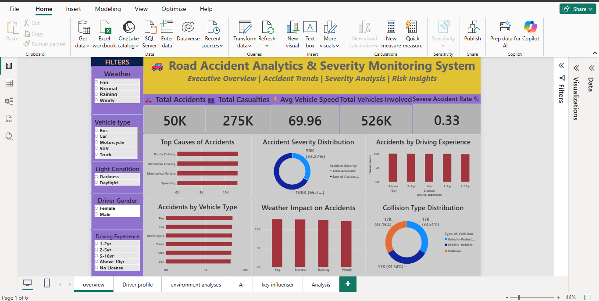
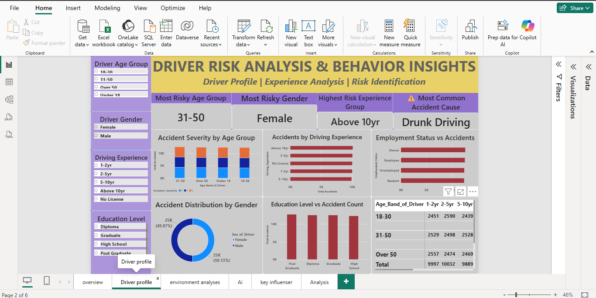
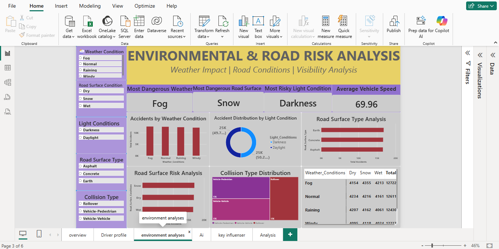
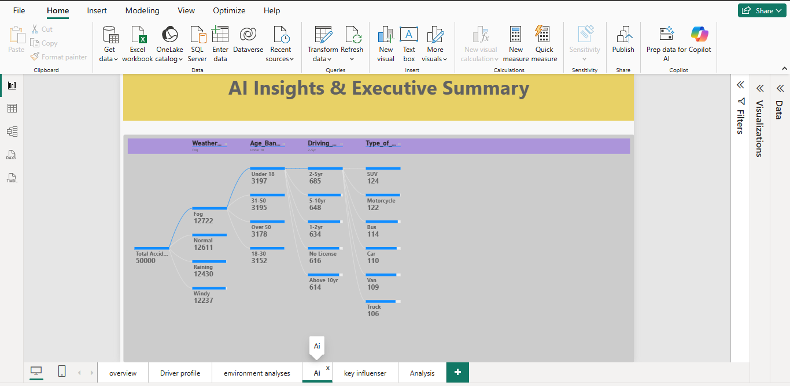
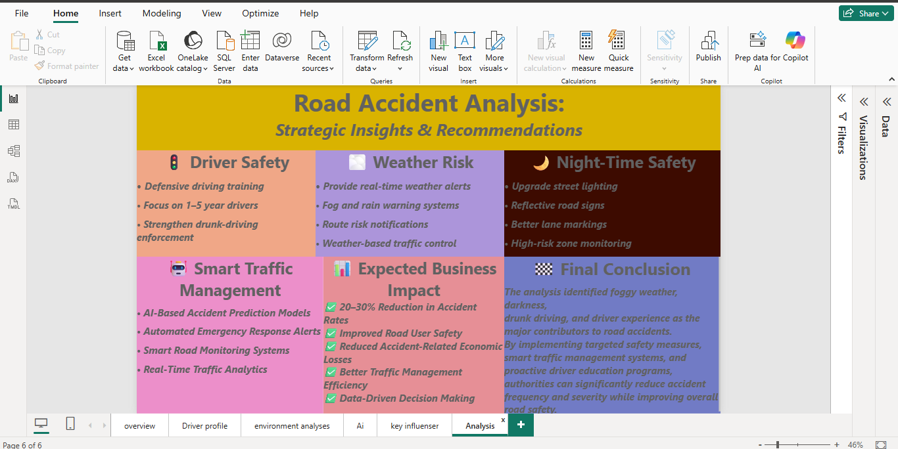

# 🚗 Road Accident Analytics & Severity Monitoring Dashboard

## Overview

This Power BI dashboard analyzes road accident data to identify accident trends, severity patterns, driver risk factors, and environmental conditions that contribute to road accidents.

## Objectives

- Analyze accident frequency and severity
- Identify major causes of accidents
- Evaluate driver-related risk factors
- Assess weather and road-condition impacts
- Generate actionable road safety insights

## Tools & Technologies

- Power BI
- Power Query
- DAX
- Data Modeling
- Data Visualization

## Dashboard Highlights

### Executive Overview
- Total Accidents
- Total Casualties
- Average Vehicle Speed
- Total Vehicles Involved
- Severity Rate

### Driver Risk Analysis
- Driver Age Group Analysis
- Gender Analysis
- Driving Experience Analysis
- Education Impact Analysis

### Environmental & Road Risk Analysis
- Weather Impact
- Road Surface Conditions
- Light Conditions
- Collision Type Distribution

### Strategic Insights
- Driver Safety Recommendations
- Weather Risk Mitigation
- Night-Time Safety Improvements
- Smart Traffic Management Suggestions

## Key Insights

- Drunk driving was identified as a major accident contributor.
- Fog and darkness significantly increased accident risk.
- Driver experience influenced accident occurrence.
- Environmental conditions played a critical role in accident severity.

## Skills Demonstrated

- Dashboard Development
- KPI Design
- Data Storytelling
- DAX Measures
- Data Modeling
- Business Intelligence

- ## Dashboard Preview

### Executive Overview

### Driver Risk Analysis

### Environmental & Road Risk Analysis

### AI Insights - Key Influencers & Decision Tree

### Strategic Recommendations & Key Insights

